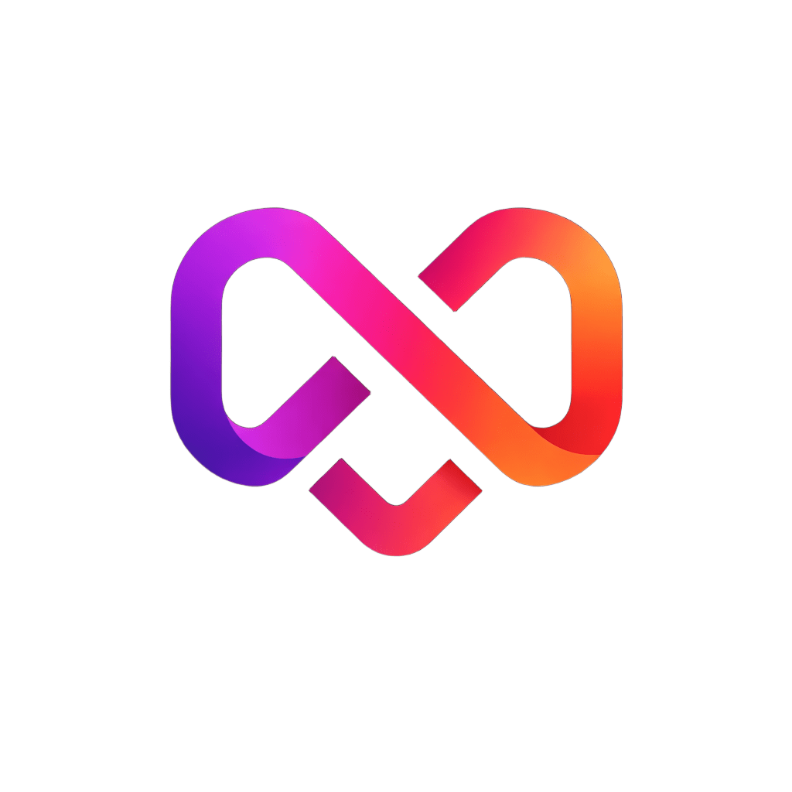

<p align="center">
  
</p>

<h1 align="center">Quan AI</h1>

<p align="center">
  
  
  
</p>

---

## 🔒 Confidentiality Notice

**CONFIDENTIAL AND PROPRIETARY.** This repository is strictly private. Access is limited solely to authorized personnel of Goorac Corporation. Unauthorized viewing, distribution, copying, or modification of this codebase is strictly prohibited and legally actionable.

---

## 🏢 About Goorac Corporation

Goorac Corporation is a software development company dedicated to building highly scalable applications and next-generation solutions. Our engineering focus lies in creating robust backend infrastructures and seamless, innovative platforms that push the boundaries of modern technology. 

Quan AI is a proprietary flagship project representing our commitment to advanced, real-time communication and AI technologies.

## 🚀 Project Overview

Quan AI is a proprietary web-based conversational AI interface. It serves as the core frontend shell for Goorac Corporation's internal AI initiatives, engineered to deliver a native-feeling, zero-latency user experience across platforms.

*(Note: Specific architectural features and capability documentation have been intentionally omitted from this document for security and intellectual property protection.)*

---

## 💻 Internal Developer Setup

1. **Clone the secure repository:**
   ```bash
   git clone [INSERT_PRIVATE_REPO_URL]
   cd quan-ai
